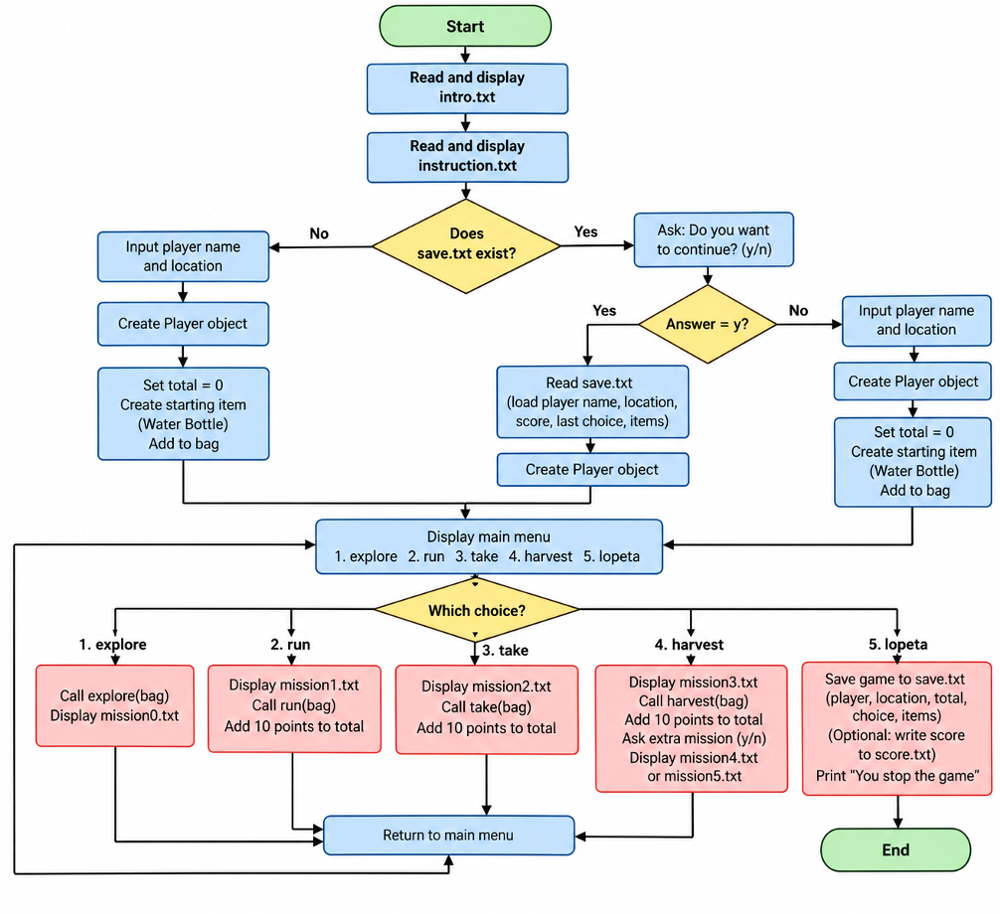

# Python game project called Save Forest. Save Forest is a simple text-based adventure game about protecting the environment.
# First of all, the game imports the functions and files such intro, instruction or missions need to run the game. There 4 main missions and 01 extra mission.
from item import Item
from function import main_menu
from function import score
from function import explore
from function import run
from function import take
from function import harvest

with open("project5/intro.txt", "r") as file:
    intro = file.read()
    print(intro)
with open("project5/instruction.txt", "r") as file:
    instruction = file.read()
    print(instruction)
with open("project5/mission0.txt", "r") as file:
    mission0 = file.read()
with open("project5/mission1.txt", "r") as file:
    mission1 = file.read()
with open("project5/mission2.txt", "r") as file:
    mission2 = file.read()
with open("project5/mission3.txt", "r") as file:
    mission3 = file.read()
with open("project5/mission4.txt", "r") as file:
    mission4 = file.read()
with open("project5/mission5.txt", "r") as file:
    mission5 = file.read()
with open("project5/score.txt", "r") as file:
    saved_score = file.read()

item = Item("Water Bottle", 100)
bag = [item]
total = 0
# Second, check data in the save.file to get the player's data. 
# If a saved game exists, the player can choose to continue the previous game. The program loads the saved information, such as the player's name and score.
import os
if os.path.exists("project5/save.txt"):
    ans = input("Do you want to comtinue the game? (y/n): ")
    if ans.lower() == 'y':
        with open("project5/save.txt", "r") as file:
            lines = file.readlines()
            player_name = lines[0].strip()
            player_location = lines[1]
            total = lines[2].strip()
            print("\nWelcome back", player_name)
            print("Location:", player_location)
            print(total)
        choice = input("\n✅ Enter a command from the main menu:\n 1.explore\n 2.run\n 3.take\n 4.harvest\n 5.lopeta\n").strip()
    else:    
        print("Please input your information:")
        from player import Player
        player_name = input("   - Name of gamer: ")
        player_location = input("   - Location: ")
        player = Player(player_name, player_location)
        total = 0
        choice = main_menu()
# If there is no saved game, or the player doesn't want to continue, the program starts a new game. The game will show the menu for different actions.
# The game will call related function such as show menu function, complete missions then collect items on the bag.  
total = 0
while choice != "lopeta" and choice != "5":
    if choice == "explore" or choice == "1":
        explore(bag)
        print(mission0)
        choice = main_menu()

    elif choice == "run" or choice == "2":
        print(mission1)
        run(bag)
        total= score(total)
        print(f"🔅 Congratulation! You completed the 1st mission. Your score is {total}.")
        choice = main_menu()

    elif choice == "take" or choice == "3":
        print(mission2)
        take(bag)
        total= score(total)
        print(f"🔅 Congratulation! You completed the 2nd mission. Your score is {total}.")
        choice = main_menu()

    elif choice == "harvest" or choice == "4":
        print(mission3)
        harvest(bag)
        total= score(total)
        print(f"🔅 Congratulation! You completed the 3rd mission. Your score is {total}.")
        print("\n🏁 Now you need to return to the starting point.")
        extra = input("Do you want to do extra mission? \n   - Yes\n   - No\n")
        if extra == "yes" or extra == "Yes" or extra == "y":
            print(mission4)
        else:
            print("You can go through the forest and walk to the starting point.")
        selection= input("\nNow is your choice, you can change your mind:\n   1.Walk 🌳\n   2.Boat 🛶\n")       
        if selection == "boat" or selection == "2":
            print(mission5)
            total= score(total)
            print(f"🎉 Congratulation! You completed the Save Forest adventure. Your score is {total}.")
            break
        else:  
            print("You follow your map and compass then reach the starting point.")
            print(f"🎉 Congratulation! You completed the Save Forest adventure. Your score is {total}.")
        break

# After the player finishes the game, the game saves the player's information and score into a text file, so the player can continue the game later.
with open("project5/score.txt", "w") as file:
    file.write(f"🎉 Congratulation! You completed the mission. Your score is: {total}")
with open("project5/save.txt", "w") as file:
    file.write(f"Player: {player_name}\nLocation:{player_location}\nScore: {total}\nChoices: {choice}")

print ("You stop the game")

